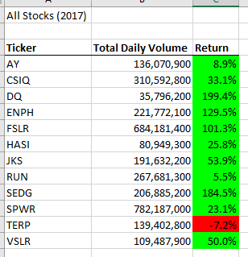
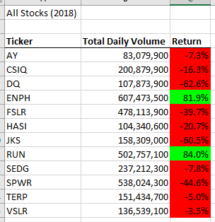
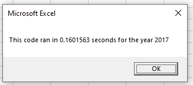
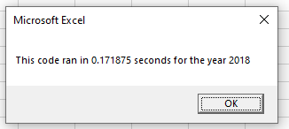
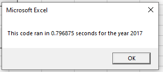
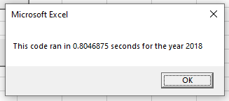

# stock-analysis
This is a repository for analysis of stocks.

## Overview of Project 
Steve has been researching stocks to assist his parents in investing. We assisted him in writing a VBA code for specific Green Stocks. After running this analysis, he decided that we should refactor this code to run faster because it is too slow if there are many more stocks in the dataset. Given this challenge, we refactored the code to run faster and prepare him to research many more stocks. After refactoring this code to make in run more quickly, we are ready to analyze the results our dataset and code.

## Results
 

From the above pictures, you can see that overall, Green Stocks performed much better in 2017 than in 2018. There are two major exceptions though, RUN with grew 5.5% in 2017 and 84% in 2018 and then ENPH which grew an astounding 129.5% in 2017 and 81.9% in 2018. While ENPH's volume was similar in 2017 and 2018, RUN more than doubled its volume from 2017 to 2018 indicating that there was highd demand for this tock in 2018. This high demand probably indicates that RUN has changed something in their business model and is growing rapidly and thus investors want to buy it. ENPH's lower, but similar volume indcates that the demand for its stock remained stable and thus continued its astounding growth in price.

 

The above pictures show the run times for the refactored script. The below pictures will show the previous run times before the script was refactored.

 

As seen in these pictures, the refactored script greatly increased the run times. This will be very beneficial to Steve as he adds more stocks to his research. The lower run times indicate that the code is running more efficiently and quicker. As datasets increase, Steve will be able to run the code quicker than previously.

## Summary
When refactoring a script, the main advantages are increasing the efficiency of code and adding additional lines of code to increase the power of the analysis. The main disadavantages of refactoring are that it takes time and gives someone the opportunity to add miswritten lines to the original code. 

For this specific project, I found that the biggest pro of refactoring this script was that the code now runs more efficiently and is ready to be expanded for more datasets. The biggest con was that I kept making mistakes in my code so it took me a long time to write and fix the refactored code.
